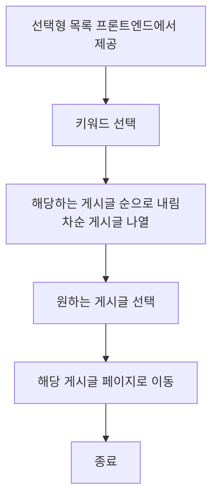
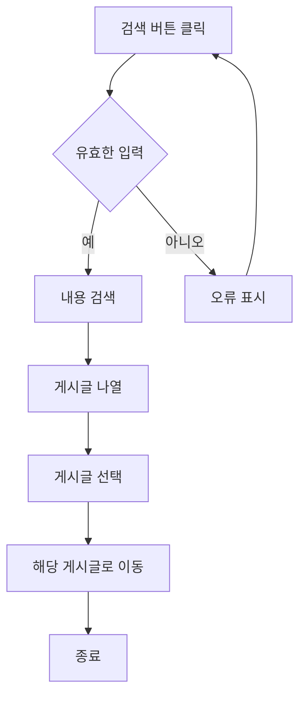
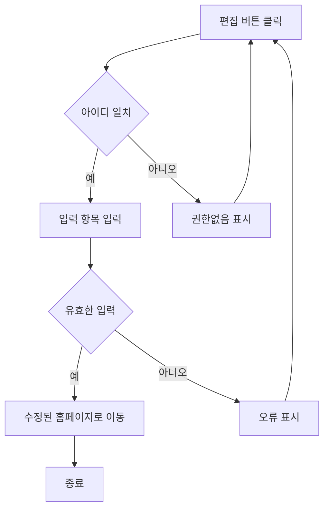

# 기능 정의서

프로젝트 정의서의 사용자 스토리를 기반으로 세부 기능을 구체적으로 정의합니다.

## 블로그 메인 페이지

### 블로그 메인 페이지로서 블로그 소개 및 게시글의 정렬, 검색 기능이 있습니다.

#### 1. 기능명: 게시글 정렬 기능

* 기능 설명
  * 게시글을 사용자가 선택한 기준대로 나열한다.
* 입력 항목
  * 정렬 목록: 선택형 목록 (프론트엔드에서 제공)

##### 1.1 사용자 액션

##### 정렬

* 정렬 버튼 클릭
  * 선택형 목록(프론트엔드에서 제공) 선택
  * 해당하는 게시글 순으로 내림차순 게시글 나열
  * 원하는 게시글 선택
  * 해당 게시글 페이지로 이동

---

#### 2. 기능명: 게시글 검색 기능

* 기능 설명
  * 게시글을 사용자가 입력한 키워드로 게시글을 검색한다.
* 입력 항목
  * 키워드 : 문자열, 최대 15자

##### 2.1 사용자 액션

##### 검색

* 검색 버튼 클릭
  * 검색하고자 하는 키워드 입력
  * 입력 항목 유효성 검사 실행
  * 유효성 검사 오류 발생시 등록 절차는 종료되며 사용자에게 오류 정보 알림
  * 키워드에 해당하는 내용 검색
  * 정확도 순으로 게시글 나열(정확도 기준은 해당 키워드의 중첩수로 정함. )
  * 원하는 게시글 선택
  * 헤당 게시글 페이지로 이동

#### 3. 기능명: 블로그 메인페이지 편집

* 기능 설명
  * 블로그 메인페이지의 기본 정보들을 편집한다.
* 입력 항목
  * 상단 이미지 : 이미지파일
  * 블로그 제목 : 문자열, 최대 15자
  * 자기 소개글 : 문자열, 최대 50자
  * 블로그 소개글 : 문자열, 최대 50자
  * 카태고리 개수 : 정수형,20이하
  * 카태고리 이름 : 문자열, 최대 15자,(카테고리 개수만큼 생성)
  * 카태고리 이름 : 문자열, 최대 15자,(카테고리 개수만큼 생성)
  * 카태고리 이름 : 문자열, 최대 15자,(카테고리 개수만큼 생성)
  * sns/email/연락처 : 문자열, 최대 15자  
  
##### 3.1 사용자 액션

##### 블로그 편집

* 편집 버튼 클릭
  * 접속 아이디와 블로그 아이디 비교
  * 정보가 다를시 권한이 없다는 시스탬창 표시
  * 권한이 있을시 입력항목 입력
  * 입력 항목 유효성 검사 실행
  * 유효성 검사 오류 발생시 등록 절차는 종료되며 사용자에게 오류 정보 알림
  * 유효성 검사 통과시 수정된 홈페이지로 이동 

