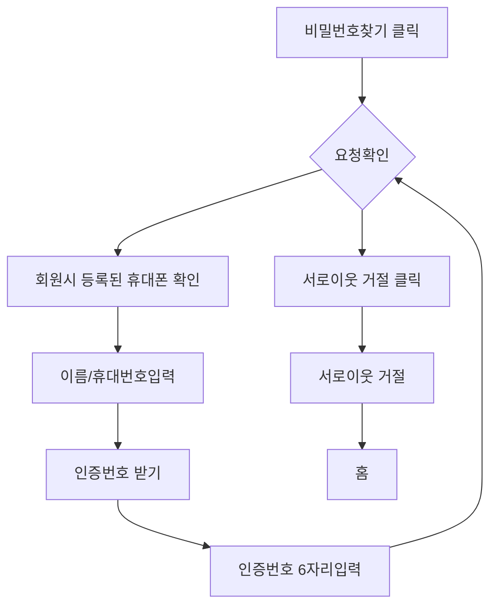

# 로그인 추가 기능


## 1. 기능명: 로그인
 
    기능 설명
    블로그에 가입된 경우 로그인을 수행할수 있습니다. 
    참고:https://help.naver.com/service/5640/contents/973?lang=ko

 입력항목
 - 아이디:  5~20자의 영문 소문자, 숫자와 특수기호 -, _ 만 사용 가능합니다. 
 - 패스워드: 8~16자 영문 대/소문자, 숫자, 특수문자만 사용 가능합니다
 - 사용 가능한 특수문자 33자: ! " # $ % & ' ( ) * + , - . / : ; ? @ [ ＼ ] ^ _ ` { | } ~ \

1.2 사용자 액션

- 추가 버튼 클릭
    - 로그인 버튼
    - 로그인 상태유지
    - 비밀번호 찾기
    - 아이디 찾기
    - 회원가입

    로그인 
    ```mermaid
    flowchart TD
    A[아이디 입력]-->B[패스워드 입력]-->c[로그인 DB 인증]-->d[로그인성공]
    ```
        

   회원가입
    ```mermaid
     flowchart TD
        A[이웃 추가 클릭]-->B[추가할 그룹 선택]-->c[인사 메시지 등록]-->d[추가]-->g[서로이웃 추가]-->h[서로 이웃 요청 표시]
    ```

## 2. 기능명: 비밀번호찾기

    기능 설명
    사용자가 아이디를 알고있을 경우 비밀번호를 찾는다. 

사용자 액션
- 아이디 입력
- 휴대전화로 본인인증
- 가입시 작성한 이메일로 패스워드 변경 페이지 발송 



## 3. 기능명 : 이웃 관리

    기능 설명
    사용자가 추가했거나 승인한 이웃 목록을 확인하고 삭제할 수 있는 기능입니다.

사용자 액션
- 이웃 목록 클릭
- 서로이웃 목록 클릭
- 그룹 이동 클릭
- 이웃 삭제 클릭


