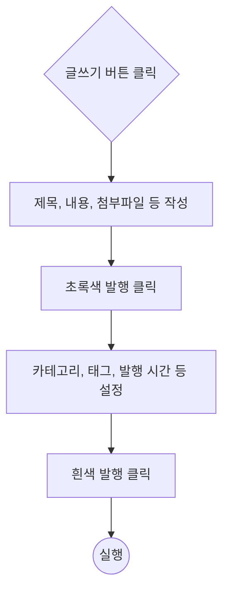
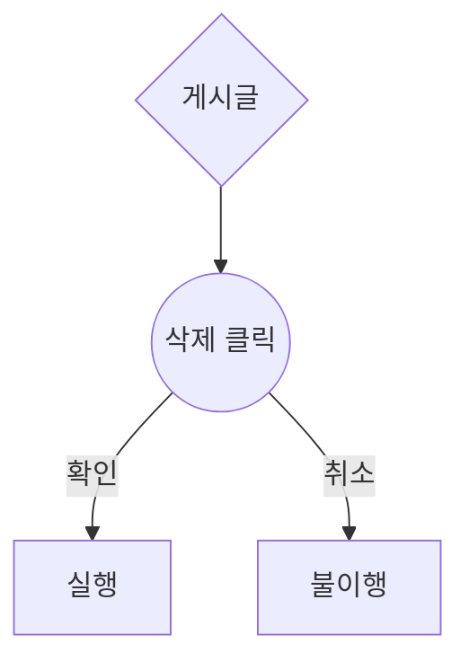
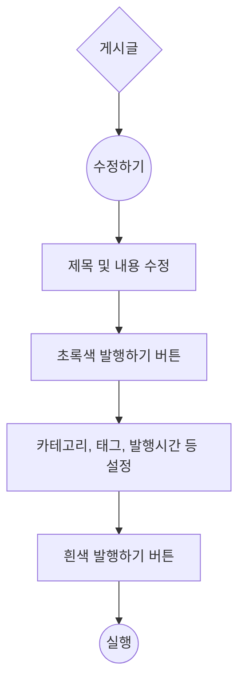

# 기능 정의서

## 글쓰기 사용자 스토리

### 내 블로그에서 새로운 글을 작성하고 싶다.

#### 1. 기능명: 블로그 글 작성

+ 기능 설명
    - 네이버 블로그의 '내 블로그'에서 새로운 글을 작성하기 위함
+ 입력 항목
    - 제목 : 텍스트
    - 내용(본문) : 텍스트, 이미지, 동영상, 하이퍼링크 ...

---
#### 1.1 사용자 액션

1. 글쓰기
+ 글쓰기 버튼 클릭
    - 제목, 내용, 첨부파일 등 작성
    - 발행하기(초록)
    - 카테코리, 태그, 발행 시간(예약 혹은 즉시 발행) 등 설정
    - 발행하기(흰색)
    - 실행

2. 글삭제
+ 삭제하고자 하는 게시글 클릭
    - 삭제 버튼 클릭
    - 팝업창(확인/취소)
    - 실행 및 불이행

3. 글수정
+ 수정하고자 하는 게시글 클릭
    - 수정 버튼 클릭
    - 제목 및 내용 수정
    - 초록색 발행하기 클릭
    - 흰색 발행하기 클릭
    - 실행

