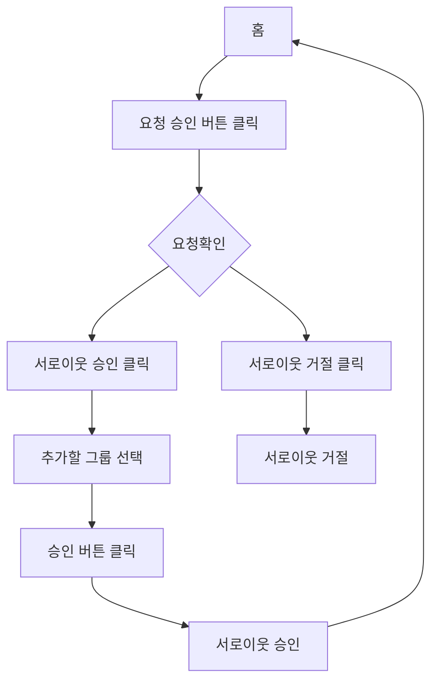
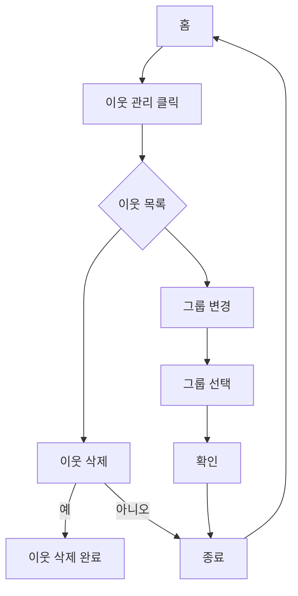

# 이웃 추가 기능


## 1. 기능명: 이웃 추가
 
    기능 설명
    사용자가 타인의 블로그에 접속하여 이웃 추가 버튼을 누르면 이웃을 추가할 수 있습니다.
    서로이웃 추가 시 사용자는 타인이 서로이웃을 승낙하여야 서로이웃 추가가 완료됩니다.

 입력항목
 - 그룹 개설:문자열, 최대 8자 (사용자 선택)
 - 인사메시지 입력: 문자열, 최대 50자
 

1.2 사용자 액션

- 추가 버튼 클릭
    - 그룹 선택
    - 이웃 추가/서로이웃 추가 (체크박스)
    - 인사메시지 등록
    - 이웃 추가/서로이웃 추가 클릭

    ```mermaid
    A[이웃 추가 클릭]-->B[추가할 그룹 선택]
    B-->i[이웃으로 추가]-->e[이웃완료 표시]
    B-->c[서로이웃으로 추가]-->d[인사 메시지 등록]-->g[추가]-->h[서로이웃 요청 표시]
    ```

## 2. 기능명: 이웃 승인

    기능 설명
    타 사용자로부터 서로이웃 요청이 왔을 때 사용자가 승인 및 거절할 수 있는 기능입니다.


사용자 액션
- 서로이웃 요청 버튼 클릭
- 승인/거절 버튼 클릭
- 추가할 그룹 선택



## 3. 기능명 : 이웃 관리

    기능 설명
    사용자가 추가했거나 승인한 이웃 목록을 확인하고 삭제할 수 있는 기능입니다.

사용자 액션
- 이웃 목록 클릭
- 서로이웃 목록 클릭
- 그룹 이동 클릭
- 이웃 삭제 클릭



