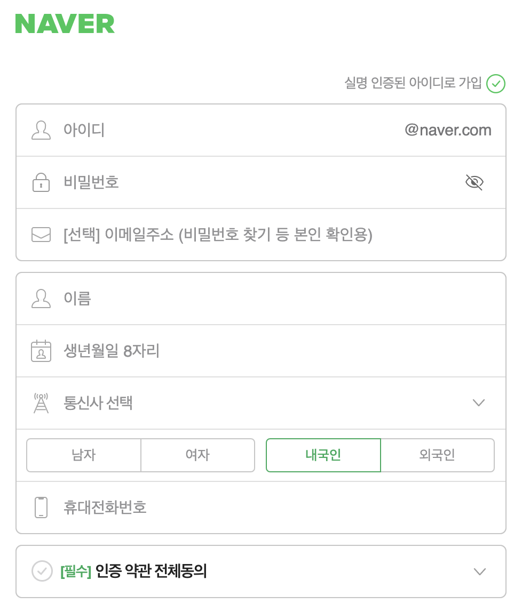

## 프로젝트 정의

> 네이버 블로그를 사용하기 위한 회원이 되기 위해 회원가입 할 수 있는 페이지




### 설치

---

회원가입 페이지는 서버와 클라이언트 시스템으로 구성되며 React 기반으로 구성되어있습니다.
프로젝트 저장소를 다음 설명에 따라 개발자 컴퓨터에 복사하고 설치 명령을 입력하여 설치를 할 수 있습니다.

```
git clone https://github.com/ibare/devcamp-onboarding-template.git my-project

cd my-project

npm install
```

프로젝트를 다운로드하고 설치하기 위해서는 git과 React가 설치되어 있어야 합니다.
설치되어 있지 않다면 아래 링크에서 사용자 환경에 맞는 버젼을 설치해주세요.

- [Git - Download](https://git-scm.com/downloads)
- [React - Download](https://reactjs-kr.firebaseapp.com/docs/installation.html)

### 실행

---

개발자 로컬 환경에서 개발 모드로 실행하기 위해선 프로젝트 루트 디렉토리에서 다음의 명령을 실행하세요.

```
npm run dev
```

### 배포

---

프로젝트의 배포 버젼을 생성하기 위해 빌드 스크립트를 실행합니다.

```
npm run build:production
```

개발 환경 배포 빌드는 build:develop 스크립트를 사용해주세요. 운영 환경 빌드는 build:production 스크립트를 사용해주세요.

### 문서

---

프로젝트 설계 문서는 design 디렉토리에 마크다운 파일로 기록되어 있습니다.
각각의 설계 문서는 다음과 같습니다.

- 기능 정의서
  - 사용자 스토리 기반으로 세부 기능을 정의합니다.
