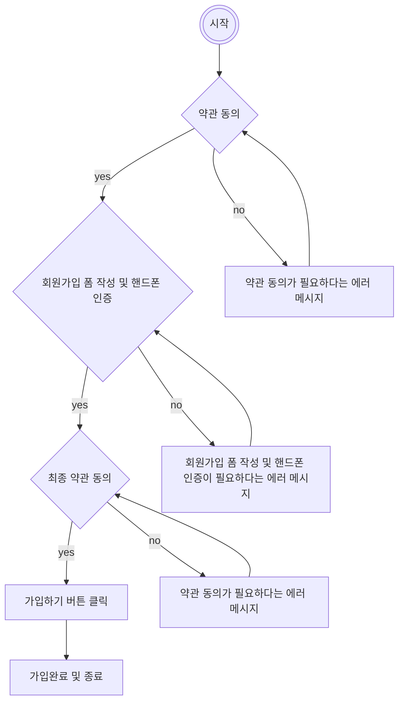

## 기능정의서

### 회원가입 사용자 스토리

---

> 회원가입을 하지 않았지만 블로그에 글을 작성하거나 이웃추가를 하고 싶습니다. 그래서 회원가입을 하고 싶어요

**1. 약관 동의**

- 서비스 이용 약관에 동의하는 지 여부 : 필수
- 가입하고자 하는 사용자의 개인정보 수집 및 이용하겠음에 동의하는 지 여부 : 필수
- 수집된 개인정보를 토대로 이벤트/혜택 정보를 수신하는 것에 동의하는 지 여부 : 선택

**2. 가입 폼**

2-1. 아이디, 비밀번호 입력 폼

- 사용자가 원하는 아이디를 입력
- 사용자가 원하는 비밀번호를 입력
  - 보안을 위해 정해진 규칙에 따른 비밀번호만 설정 가능
- 비밀번호 찾기 등 본인 확인 시 사용할 타 서비스의 이메일 주소 입력 : 선택

2-2. 사용자 인증

- 사용자가 핸드폰 인증을 통해 가입을 진행할 수 있는 사용자인지 확인
  - 이름
  - 생년월일
  - 사용하는 통신사
  - 성별
  - 내국인/외국인
  - 핸드폰 번호

**3. 인증 약관 전체동의**

- 약관 내용을 펼쳐볼 수 있고 동의하는 지 여부 : 필수

**4. 가입하기**

- 위 카테고리를 모두 정상적으로 작성한 경우 활성화
  - 빠진 부분이 있다면 비활성화
  - 사용자 인증이 정상처리 되지 않았다면 비활성화
- 활성화된 버튼 클릭 시 정상적으로 회원가입

---

### 유저 플로우 다이어그램

